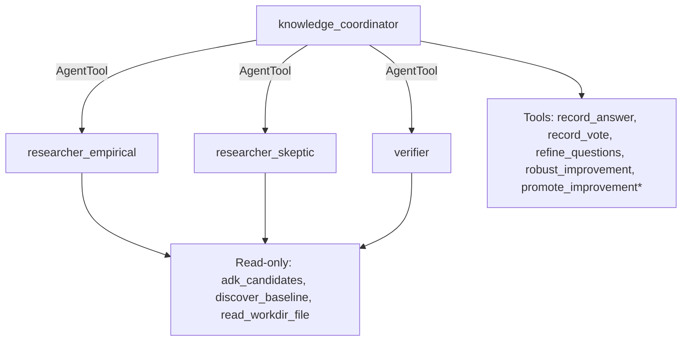

# Knowledge Improvement Loop (Claude multi-agent, CFR)

## Overview

A Claude-backed ADK team that improves a Kaggle evaluation baseline one round
at a time. Each round it:

1. **Asks** at most three questions about what would most improve the score,
   one of which can be "which ADK component should we add".
2. **Answers each question twice**, with two researchers that differ on
   purpose: `researcher_empirical` answers from the data, and
   `researcher_skeptic` looks for where the obvious answer fails. A `verifier`
   checks each answer's cited numbers and import paths and votes
   supported or unsupported.
3. **Refines the deep belief network of questions** (`refine.py`). Answers are
   split into atoms, the content words and word pairs `horizon-probe` uses.
   An atom is significant when its use differs between the two branches:
   mutual information of at least 0.1 bits and ln BF of at least 1.0, as in
   `horizon-probe`. A question's value is the total MI of its significant atoms
   times the confidence of its best answer, the Beta-posterior mean of its
   verifier votes. The top questions are kept. Their follow-ups target the
   significant atoms whose answer is least settled, ranked by MI times the
   binary entropy of the confidence.
4. **Chooses the improvement with counterfactual regret minimization**
   (`cfr.py`, CFR+). The baseline table gives a matrix of mean improvement over
   the baseline candidate for each candidate and slice. Solving it as a game
   against an adversary who picks the slice gives the candidate mix with the
   best guaranteed improvement. The best-on-average candidate is reported next
   to it, because the two can differ.
5. **Promotes** the change only after a person confirms it: `promote_improvement`
   is a `FunctionTool` with `require_confirmation=True`.

The ADK candidates (`adk_catalog.py`) come from introspecting google-adk
2.11.0 and from reading adk.dev. `adk_candidates` re-checks every import path at
runtime. The loop itself uses three of them: `App`, `ReflectAndRetryToolPlugin`
(subclassed so a `{"status": "error"}` tool result triggers a reflected retry),
and tool confirmation.

## Baseline

The baseline is read from `KAGGLE_BASELINE_DIR`, which defaults to
`/kaggle/input/datasets/scottweeden/gemma4-evidently-examples`. Any CSV or JSON
Lines table with a candidate column, a slice column and a numeric score works,
such as an Evidently per-row export. **This sample has not been run on that
dataset**: it was not reachable from where this was built (Kaggle API 403).
Run `discover_baseline` on Kaggle first to see its files and columns.

## Graph



`*` needs human confirmation.

## Run

```bash
pip install -r requirements.txt
export ANTHROPIC_API_KEY=...
export LOOP_WORKDIR=./work
export KAGGLE_BASELINE_DIR=/kaggle/input/datasets/scottweeden/gemma4-evidently-examples
adk web .
```

## Tests

No API key, no Kaggle access needed; the model is scripted:

```bash
pytest tests -q
```

The CFR solver is checked against Kuhn poker's known equilibrium value (-1/18)
and rock-paper-scissors.

## Limits

- The baseline improvement is unverified until the loop runs on the real
  dataset.
- Atom significance with few answers per branch is exploratory, the same
  caveat `horizon-probe` gives.
- CFR here solves a one-shot matrix game per round. The payoffs are sample
  means, so the guaranteed improvement is only as good as the rows behind each
  cell. `counts` reports them.
- A Claude judge for ADK's rubric metrics is untested.

## Related

- [Guide](docs/guides/knowledge_loop/index.md)
- [LoRA improvement loop](../lora-improvement-loop/README.md)
- [horizon-probe](../horizon-probe/README.md), the source of the Bayesian decomposition
