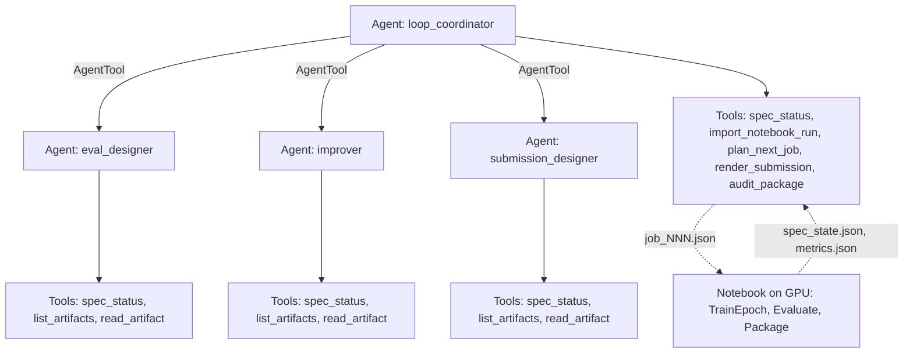

# LoRA Improvement Loop (Claude multi-agent)

## Overview

A four-agent team, all backed by one `Claude` model
(`google.adk.models.anthropic_llm`, default `claude-opus-5-5`), that closes an
improvement loop around the baseline Kaggle notebook
`gemma4-lora-prophecy-wet-31b` (a LoRA for `gemma-4-31b-it-qat-w4a16-ct`). A
coordinator verifies the notebook's last run, plans the next training job, and
renders and audits a candidate submission package. Three read-only specialists,
wrapped as `AgentTool`s, design the evaluation, propose the next change, and
design the submission's own multi-agent shape (a main agent plus a read-only
`code_analyzer` sub-agent on `tool_lora`).

The loop is governed by a **trace-language specification**: the notebook's
`SpecMonitor` (the actions `TrainEpoch`, `Evaluate`, `Package`, `Submit`,
`Tick` and `Judge` of `Gemma4Agent.tla`) ported to pure functions in
`spec.py`. `check_trace` replays a recorded `spec_state.json` and reports every
step the spec does not allow, so a run the notebook claims is only trusted if
its trace is in the spec's language. The **prophecy variable** `p` (Lamport and
Merz, *Prophecy Made Simple*, section 4.2) stays a ghost value: it is stored and
reported at `Judge`, no guard reads it, and `spec_status` hides it from the
model.

The agents do not train and do not submit. The GPU run happens in the notebook;
`Submit` and `Judge` are human steps with no tool. Each iteration of the loop is
one agent run, then one notebook run:

```
notebook run -> spec_state.json + metrics.json
  -> coordinator: import_notebook_run -> job_NNN.json + candidate_submission/
  -> you: run the notebook with the job's env, review, zip, submit by hand
```

The design borrows its vocabulary from Legion (logical regions as the state the
tools share, tasks as the tools) but has no Legion dependency.

## Sample Inputs

- `Verify spec_state.json and metrics.json from the last notebook run, then plan the next job.`

- `The staged adapters are in staged/main and staged/tool and the training prompt is train_system.md. If the last run beat the baseline, render and audit a candidate.`

  *The coordinator checks the trace, asks `eval_designer` and `improver` for
  their advice, calls `plan_next_job` (refused if the weekly budget is spent),
  asks `submission_designer` for the analyzer prompt, calls `render_submission`
  and reports the audit.*

Install and run it with:

```bash
pip install "google-adk" anthropic pyyaml pytest pytest-asyncio
export ANTHROPIC_API_KEY=...
export LOOP_WORKDIR=/path/to/notebook/output   # holds spec_state.json, metrics.json, staged adapters
adk web .
```

## Graph



## How To

1. Verify a notebook run against the spec before trusting its numbers:

   ```python
   verdict = json.loads(loop_tools.import_notebook_run("spec_state.json"))
   ```

   A `TraceViolation` error lists the steps the spec does not allow. A
   `TraceDiverged` error means the new trace does not extend the one adopted
   earlier.

1. Keep the agent inside the project's locked settings. `plan_next_job` only
   moves the learning rate, `n_train`, `n_val`, the adapter and extra excluded
   repos. Rank 16, alpha 32, dropout 0.05, gradient accumulation 8, max length
   5120 and the language-model-only targets are written into every job as
   `locked`.

1. Copy the system prompt, never write it. `render_submission` copies the
   training prompt byte for byte, so `prompts/system.md` cannot drift from the
   prompt the adapter learned.

1. Run the notebook with the job's `env` (`LR`, `N_TRAIN`, `N_VAL`, `MAX_LEN`).
   The notebook already reads those four. It does not yet read
   `EXTRA_EXCLUDE_REPOS` or train `tool_lora`; both need a small notebook
   change before a job that uses them takes full effect.

## Pre-submit audit

`audit_package` mirrors the project checklist: layout, the 31B model name, the
adapter name resolving to a folder in `adapters/`, exact tool names, no
`exclude_modules`, the fixed `main_lora` settings, safetensors keys and ranks
(read from the file header), `system.md` against the training prompt, a
read-only `code_analyzer`, sampling ranges and the 3 GiB limit. Checks that
rest on an inferred harness schema, such as `sub_agents/*.yaml`, `subagents:`
and `eval_config.yaml`, are reported as warnings or built from the notebook's
own `agent.yaml`. Confirm them against `HARNESS_README.md` before submitting.

## Tests

No API key and no GPU needed; the model is scripted:

```bash
pytest tests -q
```

## Related Guides

- [LoRA improvement loop](docs/guides/improvement_loop/index.md) - How the spec, the tools and the agents fit together.
- [SWE patch team](../swe-patch-team/README.md) - The sibling sample whose tool contract and test style this one follows.
