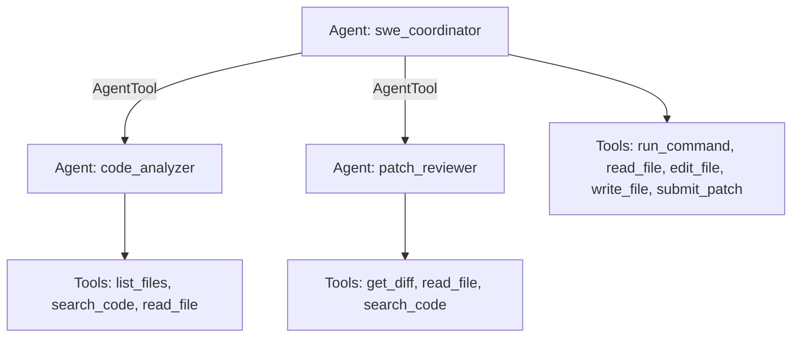

# SWE Patch Team (Claude multi-agent)

## Overview

A three-agent team, all backed by one `Claude` model
(`google.adk.models.anthropic_llm`, default `claude-opus-5-5`), that fixes an
issue in a git checkout and submits a patch. It follows the shape of an
offline SWE-bench-style harness: a coordinator that edits and verifies code,
plus two read-only specialists wrapped as `AgentTool`s so their file dumps stay
out of the coordinator's context window.

The tools in `workspace_tools.py` mirror that harness's contract (JSON
`status`/`error_type` results, 150-line / 10,000-character file reads, 5,000
character command output, `submit_patch` = `git add -N . && git diff --binary
HEAD`). The workspace is `SWE_WORKSPACE` (default: the current directory) and
must be a git repository with a committed baseline.

This runs through ADK's Python API with Claude. A declarative-YAML
submission scored under a Gemma-only rule would need its own `agent.yaml` and
the competition model instead.

## Sample Inputs

- `The add() function in calc.py subtracts instead of adding. Fix it.`

- `Make parse_header() in http/utils.py tolerate a trailing semicolon.`

  *The coordinator asks `code_analyzer` where the code lives, edits it,
  verifies with `run_command`, gets a verdict from `patch_reviewer`, then calls
  `submit_patch`.*

Install and run it with:

```bash
pip install "google-adk" anthropic pytest pytest-asyncio
export ANTHROPIC_API_KEY=...
export SWE_WORKSPACE=/path/to/git/repo
adk web .
```

## Graph



## How To

1. Share one Claude model across the team (set `SWE_CLAUDE_MODEL` to change it):

   ```python
   _MODEL = Claude(model="claude-opus-5-5", max_tokens=16384)
   ```

1. Wrap read-only specialists as tools of the coordinator. Leave
   `skip_summarization` at its default: setting it to `True` ends the parent's
   turn right after the sub-agent returns, so the coordinator would never act on
   the answer.

   ```python
   tools=[AgentTool(code_analyzer), AgentTool(patch_reviewer), ...]
   ```

1. Record the final patch in session state from `submit_patch` via
   `ToolContext`, so a caller can read `state["submitted_patch"]` after the run.


## Tests

No API key needed; the model is scripted:

```bash
pytest tests -q
```

## Related Guides

- [ADK documentation](https://adk.dev) - Agents, `AgentTool`, and the Claude model integration.
